# Building an Evergreen Secure Token System for Generative Art

When you create generative art, every slider tweak, color choice, and parameter adjustment defines a unique piece. But how do you **share** that creation without revealing the recipe? How do you let someone view your art while keeping your creative parameters hidden?

This post documents the complete journey of building a **zero-cost, evergreen, cryptographically-secure** token system for the ARTE generative art platform.

---

## The Challenge

Traditional generative art platforms face a fundamental tension:

| Approach | ✅ Pros | ❌ Cons |
|----------|---------|---------|
| **Save as image** | Easy to share | Loses interactivity, can't resize |
| **Save parameters as JSON** | Fully preserves state | Exposes your creative recipe |
| **Use random seeds only** | Simple, reproducible | Manual edits are lost |
| **Client-side encryption** | Hides parameters | Key exposed in browser code |

We needed something that combines the best of all worlds:
- ✅ **Compact**: A shareable URL
- ✅ **Secure**: Parameters hidden from reverse-engineering
- ✅ **Free**: No server costs, no database fees
- ✅ **Evergreen**: Works forever without maintenance

---

## The Solution: Hybrid Token Architecture

We built a **dual-token system** that optimizes for both speed and security:

```mermaid
flowchart TB
    subgraph Studio["🎨 Studio (Creation)"]
        A[User Edits Artwork] --> B{Action?}
        B -->|Slider Change| C[encodeParams]
        B -->|Get Secure Link| D[encodeParamsSecure]
        C --> E[v2 Token - Local, Fast]
        D --> F[Cloudflare Worker]
        F --> G[v2e Token - Encrypted]
    end
    
    subgraph ViewPage["👁️ View Page (Sharing)"]
        H[Paste Token] --> I{Token Type?}
        I -->|v2| J[Local Decompress + Verify]
        I -->|v2e| K[Cloudflare Decrypt]
        J --> L[Render Artwork]
        K --> L
    end
    
    E -.->|Copy URL| H
    G -.->|Share Link| H
```



### Two Token Types, Two Purposes

| Token | Format | Use Case | Speed |
|-------|--------|----------|-------|
| **v2** | `fx-mosaic-v2.{hash}.{data}` | Live editing in Studio | ⚡ Instant (no network) |
| **v2e** | `fx-mosaic-v2e.{hash}.{data}` | Sharing/selling artwork | 🔐 ~200ms (encrypted) |

**Why two types?**

When you're creating art, you move sliders constantly. Each adjustment regenerates the token. Making a network call for every slider movement would be painfully slow.

But when you're sharing, security matters more than speed. The encrypted token ensures your parameters are completely hidden from anyone viewing the art.

---

## Technical Deep Dive

### Token Structure

```
fx-mosaic-v2e.7e0019cc96d321d2.koymarpzu8bVMZjZuu1fM2GMSnYu...
│  │      │   │                │
│  │      │   │                └── AES-256-GCM Encrypted + Base64
│  │      │   └── SHA-256 Hash (first 16 chars)
│  │      └── Version + Encryption flag
│  └── Artwork type (mosaic, flow, tree, etc.)
└── Prefix (always "fx")
```

### The Encryption Pipeline


### Core Implementation

#### 1. Cloudflare Worker: Encryption

```javascript
// cloudflare-workers/encrypt.js
export default {
    async fetch(request, env) {
        const { type, data, hash } = await request.json();
        
        // Derive AES key from secret
        const keyHash = await crypto.subtle.digest(
            'SHA-256', 
            new TextEncoder().encode(env.ENCRYPTION_KEY)
        );
        const cryptoKey = await crypto.subtle.importKey(
            'raw', keyHash, { name: 'AES-GCM' }, false, ['encrypt']
        );
        
        // Generate random IV (12 bytes for AES-GCM)
        const iv = crypto.getRandomValues(new Uint8Array(12));
        
        // Encrypt
        const encrypted = await crypto.subtle.encrypt(
            { name: 'AES-GCM', iv },
            cryptoKey,
            new TextEncoder().encode(data)
        );
        
        // Combine IV + ciphertext → Base64
        const combined = new Uint8Array(iv.length + encrypted.byteLength);
        combined.set(iv);
        combined.set(new Uint8Array(encrypted), iv.length);
        
        const base64 = btoa(String.fromCharCode(...combined))
            .replace(/\+/g, '-')
            .replace(/\//g, '_')
            .replace(/=+$/, '');
        
        return new Response(JSON.stringify({ 
            token: `fx-${type}-v2.${hash}.${base64}` 
        }));
    }
};
```

#### 2. Cloudflare Worker: Decryption

```javascript
// cloudflare-workers/decrypt.js
export default {
    async fetch(request, env) {
        const { token } = await request.json();
        
        // Parse token
        const match = token.match(/^fx-(\w+)-v2e\.([a-f0-9]+)\.(.+)$/);
        const [, type, hash, encryptedBase64] = match;
        
        // Decode Base64 → IV + ciphertext
        const combined = Uint8Array.from(atob(base64), c => c.charCodeAt(0));
        const iv = combined.slice(0, 12);
        const ciphertext = combined.slice(12);
        
        // Decrypt
        const decrypted = await crypto.subtle.decrypt(
            { name: 'AES-GCM', iv },
            cryptoKey,
            ciphertext
        );
        
        // AES-GCM validates integrity automatically
        // If decryption succeeds, data is untampered
        
        return new Response(JSON.stringify({ 
            type, 
            data: new TextDecoder().decode(decrypted) 
        }));
    }
};
```

#### 3. Client-Side Serialization

```typescript
// utils/serialization.ts

// Sync encode for instant UI feedback
export const encodeParams = (type: ArtworkType, params: any): string => {
    const canonical = canonicalize(params);  // Sort keys, round floats
    const hash = sha256Sync(canonical);      // Synchronous SHA-256
    const compressed = compress(canonical);   // LZ-String
    return `fx-${type}-v2.${hash}.${compressed}`;
};

// Async encode with server encryption
export const encodeParamsSecure = async (type: ArtworkType, params: any): Promise<string> => {
    const canonical = canonicalize(params);
    const hash = await sha256Async(canonical);
    const compressed = compress(canonical);
    
    const response = await fetch(ENCRYPT_ENDPOINT, {
        method: 'POST',
        body: JSON.stringify({ type, data: compressed, hash })
    });
    
    const { token } = await response.json();
    return token.replace('-v2.', '-v2e.');  // Mark as encrypted
};
```

---

## Security Analysis

### What We Get Right

| Security Measure | Implementation |
|------------------|----------------|
| **Secret key isolation** | Only exists in Cloudflare environment variables |
| **No client-side key** | Browser never sees the encryption key |
| **Authenticated encryption** | AES-256-GCM validates integrity automatically |
| **HTTPS everywhere** | Cloudflare enforces TLS |
| **Stateless design** | No database to breach |
| **No silent fallbacks** | Encryption failure = user alert, not unencrypted token |

### The "Open in Studio" Protection

When someone views art with an encrypted `v2e` token:
- ✅ They can **view** the artwork
- ✅ They can **download** the artwork (4x resolution)
- ❌ The "Open in Studio" button is **hidden**

This prevents reverse-engineering by loading the encrypted token into the editor.

```tsx
// app/view/page.tsx
const isEncrypted = token.includes('-v2e.');

{!isEncrypted && (
    <Link href={`/studio?token=${token}`}>
        Open in Studio
    </Link>
)}
```

---

## Cost Analysis: Truly Evergreen

| Component | Provider | Cost |
|-----------|----------|------|
| Frontend hosting | Vercel/Netlify/GitHub Pages | $0 |
| Encryption API | Cloudflare Workers (100K req/day free) | $0 |
| Secret storage | CF Worker environment variables | $0 |
| Database | None needed (stateless tokens) | $0 |

**Total monthly cost: $0**

Cloudflare Workers' free tier provides 100,000 requests per day. Since each encryption/decryption request is tiny (~1-2KB), we're essentially unlimited for any reasonable usage pattern.

---

## Lessons Learned

### 1. AES-GCM Makes Re-Hashing Redundant

Our initial design validated tokens by:
1. Decrypt the payload
2. Re-calculate SHA-256 hash
3. Compare with token hash

But **AES-GCM is authenticated encryption**. The "GCM" mode includes an authentication tag. If decryption succeeds, the data is mathematically guaranteed to be untampered. Re-hashing added no security, just complexity.

### 2. Synchronous SHA-256 is Possible

The Web Crypto API (`crypto.subtle`) is async-only. But for an instant-feedback UI, we needed synchronous hashing.

Solution: We implemented a pure JavaScript SHA-256:

```typescript
// utils/sha256.ts - Synchronous SHA-256
export function sha256Sync(message: string): string {
    // Full SHA-256 implementation (~100 lines)
    // Returns first 16 hex chars for compact tokens
}
```

### 3. Silent Fallbacks Are Dangerous

Our first version had a fallback:

```typescript
} catch (error) {
    // If encryption fails, silently return unencrypted token
    return `fx-${type}-v2.${hash}.${compressed}`;  // ⚠️ DANGEROUS
}
```

This meant users could click "Get Secure Link" and receive an unencrypted token without knowing. We fixed this to throw an error instead:

```typescript
} catch (error) {
    throw new Error('Encryption failed. Please try again.');  // ✅ SAFE
}
```

---

## Future Directions

### 1. Key Rotation Strategy

Currently, if the encryption key is compromised, all tokens become invalid. Future improvement: version-prefixed keys.

```
fx-mosaic-v2e-k1.{hash}.{data}  // Key version 1
fx-mosaic-v2e-k2.{hash}.{data}  // Key version 2
```

The decrypt worker could maintain multiple key versions for backward compatibility.

### 2. Token Expiration

For time-limited sharing (e.g., gallery previews), we could embed expiration:

```typescript
const payload = {
    params: artworkParams,
    exp: Date.now() + 24 * 60 * 60 * 1000  // 24 hours
};
```

The decrypt worker would reject expired tokens.

### 3. Rate Limiting

Currently the API is open. Future improvement: Add Cloudflare's built-in rate limiting to prevent abuse.

### 4. NFT Integration

The encrypted token system is perfect for NFT art:
- Token = on-chain metadata (compact, permanent)
- Decryption = reveals artwork parameters
- Original artist retains encryption key

---

## Conclusion

We built a token system that:

✅ **Works forever** without ongoing costs  
✅ **Protects artist parameters** with AES-256-GCM encryption  
✅ **Stays fast** with hybrid local/encrypted tokens  
✅ **Fails safely** with explicit error handling  

The entire system runs on Cloudflare's free tier with no database, no sessions, and no maintenance required.

**The code is open source**: Check out the [cloudflare-workers/](https://github.com/mvhikhn/arte/tree/main/cloudflare-workers) directory for the full implementation.

---

## Quick Reference

### Deploy Commands

```bash
# Deploy encryption worker
npx wrangler deploy cloudflare-workers/encrypt.js \
    --name arte-encrypt \
    --compatibility-date 2024-04-05

# Deploy decryption worker  
npx wrangler deploy cloudflare-workers/decrypt.js \
    --name arte-decrypt \
    --compatibility-date 2024-04-05

# Set encryption key (BOTH workers, SAME key)
npx wrangler secret put ENCRYPTION_KEY --name arte-encrypt
npx wrangler secret put ENCRYPTION_KEY --name arte-decrypt
```

### Token Format Reference

| Component | Example | Purpose |
|-----------|---------|---------|
| Prefix | `fx` | Identifies as our token system |
| Type | `mosaic` | Routes to correct renderer |
| Version | `v2e` | `v2` = local, `v2e` = encrypted |
| Hash | `7e0019cc...` | Integrity check (16 chars) |
| Data | `koymarpz...` | Compressed + encrypted params |
